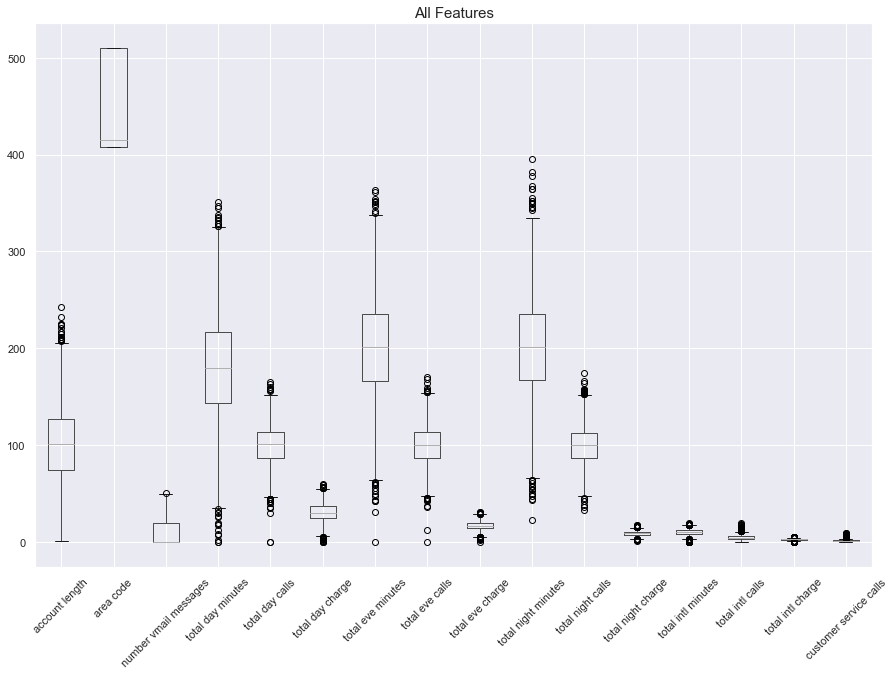
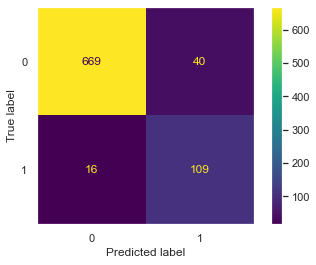

# SyriaTel Customer Churn

## Overview

Through this project, We created a predictive classification model that makes it possible to understand the business problem and solve it and report the findings of the final model, including predictions and performance metrics.

## Business Understanding

The goal of this project is to develop a classification algorithm to help SyriaTel a telecommunications company to predict whether a customer will ("soon") stop doing business with them interested in reducing how much money is lost because of customers who don't stick around very long.

## Data Understanding

This project uses SyriaTel Telecom's Churn Dataset from Kaggle, which consists of information about customer activity (features), along with a churn label specifying whether a customer canceled the subscription or still subscribes to the company. will be used to develop predictive models.

-The database contains 3333 rows (customers) and 21 columns (features). include locational information (state and area_code) as well as plan details such as call minutes, charges, customer service calls, and whether the customer had an international plan and/or voice mail plan. Customers who left within the last month – the column is called Churn.

-The “Churn” column is our target: the class False includes the clients that did not leave the company last month, while the class True contains the clients that decided to terminate their relations with the company.

-Our model iterations utilized subsets of these features as well as aggregations of these features to determine which features would best predict customer churn.

## Modeling

Through this project, We tests a variety of classification models including:

1-Logistic Regression Classifier

2-Decisioin Tree Classifier

3-Random Forest Classifer

### Baseline Model:(Logistic Regression Classifier)

Logistic Regression is a classification technique used in machine learning. It uses a logistic function to model the dependent variable. this technique is used while dealing with binary data.
The performance of the baseline model is 80%.
The recall of the baseline model is 22%.
The model predicts that 28 cases would stop subscribing Syriatel services and they left.
The model predicts that 97 cases would still subscribe Syriatel services and they are true.

### Final Model:( Decision tree Classifier with hyperparameters tuning)

A Decision Tree is a Supervised Machine Learning Algorithm that uses a set of rules to make decisions. The intuition behind Decision Trees is that you use the dataset features to create yes/no questions and continually split the dataset until you isolate all data points belonging to each class.
Pruning is a technique associated with decision trees. Pruning reduces the size of decision trees by removing parts of the tree that do not provide power to classify instances is a technique associated with decision trees. Pruning reduces the size of decision trees by removing parts of the tree that do not provide power to classify instances.

The performance of the final model is  91 %.
The recall of the final model is 87 %.
The model predicts that 109 cases would stop subscribing to Syriatel services and they left.
The model predicts that 16 cases would still subscribe to Syriatel services and they are actually true.

## Evaluation

We evaluated our models based on the recall score metric as well as F1 score, confusion matrix, and AUC.

The best model based on performance and recall is the Decision tree classifier after hyperparameter tunning.

Recall — What percent of the positive cases did we catch?

Recall = TP/(TP+FN) High recall for class 1: Predicted most True values correctly.

The model which has high recall (high sensitivity),

The reason behind choosing recall to evaluate the model is that we have to consider the impact of false negative predictions. which is more costly for the company.

We can express the false negative when the model predicts that a customer would stay with SyriaTel but in fact,they would churn/leave. 

## Conclusion and Recommendations

Customer churn in the telecom industry poses one of the most significant risks. Nobody likes losing customers.

The churn concept refers to customers that will stop subscribing to the company over a given period.

So how do we know if the company is about to lose customers? And how do we take action before it’s too late?

Through this project, We created a predictive classification model that makes it possible to understand which customers are more likely to switch or stop subscribing to the services.

predicting which users are likely to churn is only half the battle. To meaningfully reduce the churn rate, we need to operationalize that information in a way that prevents at-risk customers from churning.

We indicate the three most important features that impact the relationship between the customer and the company:

1-Total charge: Increase in domestic call charges, the best indicator of the churning behavior because that may lead to switching from the telecom service provider.

Total dollars charged refers to the amount of money that customers should pay for receiving services. Higher prices have negative effects on customer purchases and positive effects on customer churn Customers are seeking markets with fewer service prices.

Flexible and affordable billing will encourage customers to upgrade their plans with the company and improve customer satisfaction.

2-Customer service calls: The number of calls made to customer service was the significant predictor of customer churn behavior, poor customer service experiences like long wait times, and ineffective self-service options lead customers to churn.

Meaning the company needs to do some evaluation of frontline teams. The company needs to communicate with the customers across their journey and solve any bottlenecks.

Good customer service shouldn’t be reserved for new customers only the existing customers deserve great service too.

3-Voice mail plan yes: is a computer-based system that enables users to deliver voice information. It refers to a voice message that a caller leaves when the person they call is either unable to receive his call or busy with another conversation. Voicemail services are not just an option, but a requirement for any business.

Telecoms companies can improve their Voicemail Services With excellent software voicemail providers also offer faxing capabilities or allows for multiple voicemail extensions, voicemail to e-mail, voicemail to text, and much more for an affordable monthly price, The best part of this is that even if the customer's cell phone dies or stops working, voicemail still works.

## Next Steps

Further analyses could yield additional insights to further improve the model performance.

## For more information

Email :mays802004@ gmail.com 
GitHub :maysasaad

## Repository Structure

├── data ├── images ├── README.md ├── Presentation.pdf └── Jupyter notebook.ipynb
